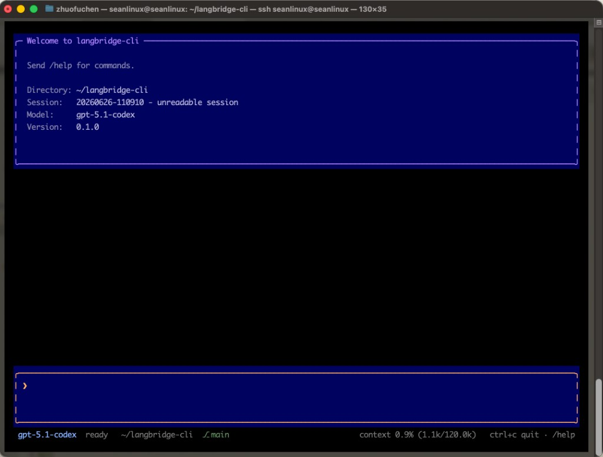

# LangBridge Code


A self-evolving coding agent with a **main agent + specialist subagents** workflow.
**Default model: Moonshot Kimi** (`kimi-k2.7-code`); **also supports OpenAI**
(e.g. `gpt-5.1-codex`). Configure in `~/.langbridge-code/config.json`
(legacy `~/.langbridge/` still works) or via env vars — see [Models & providers](#models--providers).

LangBridge Code runs a **flat orchestration pipeline**: the **LangBridge** main agent
decides when to chat vs delegate, calls **Planner** to build a markdown `todo_list`,
then dispatches **one subtask at a time** to **Worker↔Reviewer** loops (or slide
workers for decks). It compacts long context automatically and can resume prior
sessions.

Start it:

```bash
uv run langbridge-code
```

## Train (self-play)

LangBridge Code is **self-improving**: an outer **trainer** improves the team over many
tasks by editing agent artifacts directly — `tools/`, `skills/`, and
`agents/system_prompt/` — with **checkpoints** under `training/checkpoints/` so you
can restore anytime. Code lives in `src/langbridge_code/training/`.

Two nested loops:

- **Worker loop** (one task): Coder implements and Reviewer verifies until pass or limits.
- **Trainer loop**: across a batch of tasks, mine signals from traces, propose file
  edits, and **gate** them — keep a change only if eval metrics improve.

**Today `train` optimizes Coder and Reviewer primarily.** It reads **coder↔reviewer**
optimizer traces, grades with hidden tests, and checkpoints accepted edits. Full
workflow trace mining is still evolving.

Per-role **eval** (hidden **FAIL_TO_PASS / PASS_TO_PASS** tests, **langbridge-bench**
specs in `evals/langbridge-bench/specs/`). Eval lives in `src/langbridge_code/eval/`:

```bash
# Coder only
uv run python -m langbridge_code.eval.cli eval --role coder --limit 5

# Reviewer (gold + no-fix cases per task, test-based labels)
uv run python -m langbridge_code.eval.cli eval --role reviewer --limit 5

# Full coder ⇄ reviewer inner loop (same trace shape train uses today)
uv run python -m langbridge_code.eval.cli eval --role loop --limit 5

# Full workflow
uv run python -m langbridge_code.eval.cli eval --role workflow --limit 5

# Trainer epoch (direct file edits + checkpoints)
uv run python -m langbridge_code.training.cli train --epochs 1 --batch-size 2
```

For a local git repo + custom specs, set `LANGBRIDGE_TARGET_REPO` and use
`--source local`. Eval docs: `src/langbridge_code/eval/README.md`. Training docs:
`src/langbridge_code/training/README.md`.

## Loop Engineering

LangBridge Code is built around **loop engineering**: instead of a single one-shot
model call, agents run in loops until a task is done.

**One user turn** runs the full workflow to completion:

```
User prompt
  → LangBridge (chat reply OR delegate)
  → agent_planner (new / refined plan) when needed
  → read_plan → agent_worker (one unchecked subtask per call)
       [coding]  → Worker ↔ Reviewer (separate sessions, git diff handoff)
       [slide]   → Worker ↔ Reviewer (.pptx / deck deliverables)
       on pass   → agent_worker auto-marks todo [x]
       on fail   → agent_planner refines (splits task)
  → Summary reply (full project complete only when all todos are [x])
```

Safety brakes: `max_workflow_seconds`, worker/reviewer step caps, context compaction,
and optional `/goal` autonomous rounds with a Goal Evaluator.

## LangBridge Code team (workflow roles)

- **LangBridge** — main agent; coordinates tools and subagents; owns `read_plan` /
  `clear_plan`; does not implement code itself.
- **Planner** — builds or refines the markdown session plan (`update_plan`).
- **Worker** — implements one assigned subtask; may `read_plan` for read-only context;
  ends with `WORKER_STATUS: READY_FOR_REVIEW`.
- **Reviewer** — inspects git diff + worker summary; `REVIEW_VERDICT: PASS|NEEDS_WORK|FAIL`.
- **Explorer** — read-only codebase investigation (`agent_explorer`).

## How it works

The **LangBridge** main agent handles chat or kicks off multi-step work. The
**Planner** writes the full `todo_list` (Desired end state, Success criteria, todos
with `<!-- verify: ... -->` comments). For each unchecked item, LangBridge calls
**agent_worker** with a **focused subtask prompt** (not the whole plan). After
review passes, **agent_worker** marks that line `[x]` automatically — the main
agent does not ask the planner to update checkboxes. When every todo is checked,
`read_plan` shows no unchecked items and LangBridge may report the project
finished.

**Main agent tools:** filesystem, `bash`, `run_tests`, `read_plan`, `clear_plan`,
`read_webpage`, `browse_webpage`, `read_skill`, plus subagent tools
(`agent_planner`, `agent_worker`, `agent_explorer`).

**Planner tools:** `list_dir`, `glob`, `read_file`, `grep`, `update_plan`, `read_skill`,
`ask_user`.

**Worker / Reviewer tools:** filesystem tools, `bash`, `run_tests`, `read_plan`
(read-only context), `read_skill`, `agent_explorer`, plus writes (`write`,
`edit_file`, `delete_file`) for workers.

File tools are limited to the directory where you start LangBridge Code. Write tools
ask for approval first (unless yolo / auto-approve is on).

On-demand skills: specialists see a catalog of playbooks in their prompt and can
call `read_skill(name)` to load one. Bundled skills include Karpathy guidelines
and vendored [Superpowers](https://github.com/obra/superpowers) under
`src/langbridge_code/skills/_external/superpowers/`.

Each tool call includes a required `purpose` field: a short, user-visible sentence
explaining why the agent is calling that tool. It feeds the live thinking line in the TUI.

Each run writes session artifacts under `src/langbridge_code/artifacts/session-{slug}-{timestamp}/`:
`todo_list.md`, `progress.md`, and `traces/*.log`.
On startup you can resume a previous session or start a new one.

### Living agents vs. traces (memory)

Within one chat session the **main agent stays alive** across user messages.
Within one specialist session an agent stays **alive** across tool steps. Worker and
Reviewer are **fresh sessions** each handoff — they do not share message history.

Cross-turn memory for resume/cold-start uses `progress.md` (per-turn summaries).
Live turns rely on the main agent's conversation history (with context compaction).
Worklogs are unified into per-turn **trace logs** under the session's `traces/`
directory for audit/debug — not the agents' working memory.

### Status tokens (machine-checkable)

- **Worker:** `WORKER_STATUS: READY_FOR_REVIEW | IN_PROGRESS`
- **Reviewer:** `REVIEW_VERDICT: PASS | NEEDS_WORK | FAIL`

### Limits

Bounded by workflow time limits, worker/reviewer step caps, and context compaction.
On failure the Planner can split the failed todo into smaller tasks.

## Eval (benchmarks & datasets)

The `evals/` tree measures LangBridge Code on real issues and builds new task data.

### SWE-bench e2e (`evals/swe-bench/`)

End-to-end benchmark on published SWE-bench instances: checkout the repo at
`base_commit`, run headless LangBridge Code on the issue text, capture `git diff` as the
patch, then grade with the official harness (hidden tests in Docker).

```bash
# Stage 1 — generate predictions (agent inside the official SWE-bench image)
sg docker -c "uv run python evals/swe-bench/run_eval_docker.py --difficulty lite --count 10"

# Stage 2 — grade (from evals/swe-bench/)
cd evals/swe-bench && uv run python -m swebench.harness.run_evaluation \
  --dataset_name princeton-nlp/SWE-bench_Lite \
  --predictions_path out/predictions.jsonl \
  --max_workers 4 --run_id langbridge-l4-lite
```

Datasets: `lite` (~300), `verified` (500), `pro` (hard). Details and Pro caveats:
`evals/swe-bench/README.md`.

### langbridge-bench (`evals/langbridge-bench/`)

Self-built benchmark from GitHub PRs: collect merged PRs, validate with reference
tests, then materialize **one JSON per task** under `instances/` and `specs/`.

```bash
uv run python evals/langbridge-bench/collect_prs.py --repo pytest-dev/pytest --max-per-repo 5
uv run python evals/langbridge-bench/reference_test.py --run
uv run python evals/langbridge-bench/materialize.py
```

Training eval/train reads `evals/langbridge-bench/specs/` by default. See
`evals/langbridge-bench/README.md` and `evals/README.md`.

## Run

### Models & providers

LangBridge Code is **not tied to a single vendor**. Package defaults in
`src/langbridge_code/config.json` use **Moonshot Kimi**; you can switch to **OpenAI**
(or point Moonshot at a compatible base URL) without changing agent code.

| Provider (`api.provider`) | Default model | API used | API key (env or `api_keys.*`) |
| --- | --- | --- | --- |
| `moonshot` (default) | `kimi-k2.7-code` | Chat completions (`/v1/chat/completions`) | `MOONSHOT_API_KEY`, `KIMI_API_KEY`, `api_keys.moonshot` |
| `openai` | set in config (e.g. `gpt-5.1-codex`) | OpenAI **Responses** API | `OPENAI_API_KEY`, `api_keys.openai` |

Switch provider:

```bash
# one-off
LANGBRIDGE_API_PROVIDER=openai LANGBRIDGE_MODEL=gpt-5.1-codex uv run langbridge-code

# or persist in ~/.langbridge-code/config.json
```

```json
{
  "model": "gpt-5.1-codex",
  "api": { "provider": "openai", "base_url": "" }
}
```

Back to Kimi (defaults):

```json
{
  "model": "kimi-k2.7-code",
  "api": { "provider": "moonshot", "base_url": "https://api.moonshot.ai/v1" }
}
```

`LANGBRIDGE_MODEL` overrides `model` for any provider. `api.base_url` is optional
(custom OpenAI-compatible endpoint for Moonshot or a proxy).

### API keys

On first run, `langbridge-code` asks for an API key for the **active** provider and
saves it to `~/.langbridge-code/config.json` under `api_keys.<provider>`. Kimi and
OpenAI keys can live side by side:

```json
{
  "api_keys": {
    "moonshot": "sk-...",
    "openai": "sk-..."
  }
}
```

Environment overrides: `MOONSHOT_API_KEY` / `KIMI_API_KEY` (Kimi),
`OPENAI_API_KEY` (OpenAI), `LANGBRIDGE_API_PROVIDER`, `LANGBRIDGE_MODEL`.

Copy any section from `src/langbridge_code/config.json` into
`~/.langbridge-code/config.json` to override limits, paths, or tool budgets.
### Textual UI (default)

The Textual UI launches by default — a clean, command-driven layout (no button
clutter): a welcome banner, a flowing conversation, a multi-line prompt, and a
status bar.

```bash
uv run langbridge-code
```



While developing locally, prefer `uv run langbridge-code` (editable install) so code
changes take effect immediately. Use `uv sync --reinstall-package langbridge-code
--no-editable` only when you need a non-editable install.

**Commands** (type in the prompt):

| Command | Action |
| --- | --- |
| `/help` | show all commands |
| `/new` | start a new session |
| `/sessions` | open the session picker (scrollable popup, also `Ctrl+R`) |
| `/resume [n]` | open the picker, or resume session number `<n>` |
| `/delete <n>` | delete session number `<n>` |
| `/approve [on\|off]` | approve a pending action, or toggle auto-approve |
| `/yolo [on\|off]` | toggle yolo mode (auto-approve all write tools) |
| `/deny` | deny a pending action |
| `/pause` | pause / resume the running agent |
| `/stop` | stop the current turn |
| `/queue` | show queued messages waiting to run |
| `/queue clear` | drop all queued messages |
| `/goal <condition>` | work autonomously until the condition is met |
| `/goal` | show active goal status |
| `/goal clear` | remove the current goal |
| `/exit` | quit |

**Keys**: `Ctrl+A` approve · `Ctrl+D` deny · `Ctrl+Y` yolo · `Ctrl+P` pause ·
`Ctrl+S` stop · `Ctrl+R` sessions · `Ctrl+C` quit.

**Sessions**: `Ctrl+R` (or `/sessions`) opens a scrollable popup of saved
sessions — move with `↑`/`↓`, `Enter` to resume, `Esc` to cancel.

**Queue**: while a turn is running you can keep typing — messages wait in the
queue and run after the current turn finishes. Each started turn gets the next
id when processing begins; session + progress notes are written when the main
agent loop ends (success, stop, timeout, or error).

**Pause** (soft hold): holds the agent at the next step boundary and resumes the
same run in place. It takes effect *between* steps, so an in-flight model call or
tool finishes first; it also works during planner/coder/reviewer steps.

**Stop** (hard abort): aborts the current turn and hands control back, like
Cursor's stop. It cancels the in-flight model request (abandoned in the
background) instead of waiting for it, so control returns almost immediately. The
half-finished turn is discarded so the conversation history stays valid. If a
tool (e.g. `bash`) is mid-execution, Stop waits for that one tool to return
before unwinding — it never leaves a write half-applied.

**Approvals**: when auto-approve is off, the agent posts an inline approval
request for specialist write tools (`write`, `edit_file`, `multi_edit`, `apply_patch`, `delete_file`, `git_commit`,
`bash`). Approve with `Ctrl+A` / `/approve` or deny with `Ctrl+D` / `/deny`.

### One-shot (headless)

Run the agent on a single task without the interactive prompt. It reads the task
from the first argument (or stdin), auto-approves write tools, and exits when the
loop finishes. This is the path the SWE-bench eval drives.

```bash
uv run python -m langbridge_code.headless "fix the failing test in foo/bar.py"
```

Or pipe the task in on stdin:

```bash
echo "add a --verbose flag" | uv run python -m langbridge_code.headless
```

### Debug

Print compact model output lines to stderr (one line per model response):

```bash
LANGBRIDGE_DEBUG_LLM=1 uv run --no-editable langbridge-code
```

Optional line length cap (default `200`):

```bash
LANGBRIDGE_DEBUG_LLM=1 LANGBRIDGE_DEBUG_LLM_MAX_CHARS=500 uv run --no-editable langbridge-code
```
